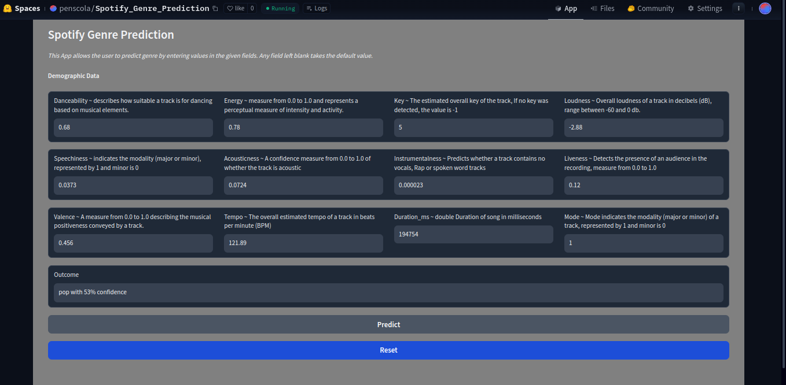

# **Music-Genre-Prediction**
Almost 30,000 Songs from the Spotify API. My main goal is to predict the genre of a song based on its audio features. I will also try to predict the popularity of a song based on its audio features.

## **Getting Started**
### **Virtual Environment and Dependencies**

1. Clone the repository to your local machine and navigate to the project directory (root):
```sh
git clone https://github.com/penscola/Music-Genre-Prediction.git
```
2. Ensure that python is installed. If it is not installed, use the following command:
```sh
sudo apt-get install python3
```
3. Install the requirment.txt using the command:

```sh
pip install -r requirements.txt
```
4. To start the Jupyter notebook run:
```sh
jupyter notebook
```
And it will be started the Jupyter Notebook in the virtual environment context on the browser. Just go to the [`src/notebook/notebook.ipynb`](https://github.com/penscola/Music-Genre-Prediction/blob/master/src/notebook/notebook.ipynb) and try to run the notebook.

```sh
python3 src/app/predict.py
```

### **Web Service Deployment**
#### **Gradio App**
To host the service locally using the virtual environment, run the python script [src/app/predict.py](https://github.com/penscola/Music-Genre-Prediction/blob/master/src/app/predict.py) to start the Gradio application:

### Cloud Deployment
The model was deployed to the cloud using HuggingFace Spaces.

1. Create an [account](https://huggingface.co/join) on HuggingFace Spaces.

2. Create a new space and upload the model file model.pkl and the file app.py to the space.

3. Deploy the model to the cloud using the HuggingFace Spaces interface.

##### [Demo](https://huggingface.co/spaces/penscola/Spotify_Genre_Prediction)



